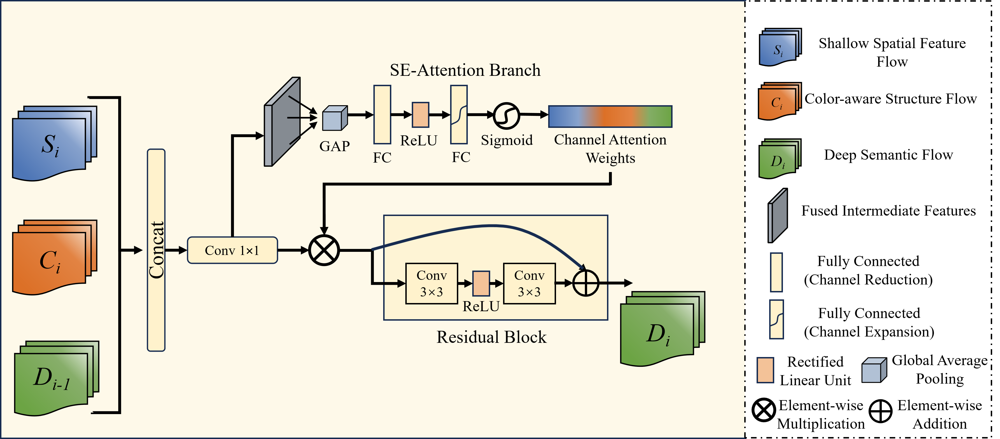
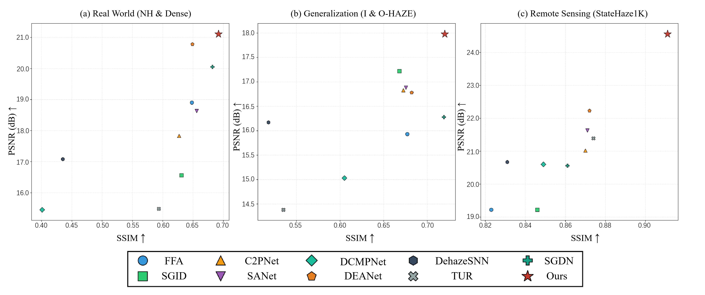

# ADF-Net: Asymmetric Dual-encoder Fusion Network with Physics-Color Prior 🌫️

ADF-Net is a deep learning network for **single image dehazing**, designed to effectively remove haze while preserving fine structures and realistic colors.


---

## ✨ Highlights

- Asymmetric **dual-encoder** with color–structure prior for robust feature extraction  
- **Physics-guided prediction head (PPH)** for accurate atmospheric light and transmission estimation  
- **Tri-feature attention fusion decoder (TAF)** for effective multi-branch feature fusion  

---

## 🏗️ Architecture

ADF-Net mainly consists of:

1. **Asymmetric Dual-Encoder Network with Color-Structure Prior**  
   - S-Encoder extracts deep semantic features with residual blocks and strided convolutions  
   - CSEM provides clean high-frequency structural priors  
2. **Physics-Guided Prediction Head (PPH)**  
   - Predicts atmospheric light and transmission maps in a physics-consistent manner  
3. **Tri-Feature Attention Fusion Decoder (TAF)**  
   - Integrates features from different streams via DFAB for high-quality reconstruction  



---

## 📊 Quantitative Results

ADF-Net achieves competitive performance on several benchmarks:

| Dataset      | PSNR  | SSIM  | CIEDE2000 |
|-------------|-------|-------|-----------|
| NH-HAZE     | 21.65 | 0.773 | 8.471     |
| Dense-Haze  | 20.57 | 0.612 | 10.901    |
| I-HAZE      | 16.79 | 0.721 | 11.466    |
| O-HAZE      | 19.18 | 0.718 | 9.554     |
| StateHaze1k | 24.56 | 0.911 | 5.349     |

### Visualization 📷

- Performance scatter:



- Qualitative comparisons:
  - NH-HAZE  
    
  - Dense-Haze  
    
  - O-HAZE  
    
  - StateHaze1k (Thick)  
    

---

## 🚀 Getting Started

### 1️⃣ Environment Setup

```bash
# clone repo
git clone https://github.com/XoomitLXH/ADF-Net.git
cd ADF-Net

# create conda env
conda create -n adf-net python=3.8
conda activate adf-net

# install dependencies
conda install pytorch==1.10.0 torchvision==0.11.0 torchaudio==0.10.0 cudatoolkit=11.3 -c pytorch -c conda-forge
pip install -r requirements.txt
```

### 2️⃣ Data Preparation

1. Download the following datasets:
- [NH-HAZE](https://data.vision.ee.ethz.ch/cvl/ntire20/nh-haze/)
- [Dense-HAZE](https://data.vision.ee.ethz.ch/cvl/ntire19//dense-haze/)
- [I-HAZE](https://data.vision.ee.ethz.ch/cvl/ntire18//i-haze/)
- [O-HAZE](https://data.vision.ee.ethz.ch/cvl/ntire18//o-haze/)
- [StateHaze1k](https://github.com/StateHaze/StateHaze1k)

2. Organize your datasets in the following structure (you can adapt to your own paths as needed):

```text
ADF-Net/
├── datasets_train/
│   ├── NH-HAZE/
│   │   ├── hazy/          # Hazy images
│   │   └── clean/         # Ground truth clear images
│   ├── I-HAZY/
│   ├── O-HAZY/
│   └── ...
├── datasets_test/
│   ├── NH-HAZE/
│   │   ├── hazy/          # Hazy images
│   │   └── clean/         # Ground truth clear images
│   ├── I-HAZY/
│   ├── O-HAZY/
│   └── ...
├── train_ADF.py
├── model_ADF.py
└── ...
```

> 💡 Please prepare / download the dehazing datasets (e.g., indoor/outdoor synthetic or real hazy datasets) according to your experimental setting. This repo assumes the above directory structure.

---

## 🧪 Training

Example training command (Middleburry-style data, single GPU):

```bash
python train_ADF.py \
  -learning_rate 1e-4 \
  -train_batch_size 4 \
  -train_epoch 30000 \
  --type 3 \
  --gpus 0
```

You can adjust:

- `-learning_rate` – learning rate  
- `-train_batch_size` – batch size  
- `-train_epoch` – number of training iterations/epochs  
- `--type` – dataset type index  
- `--gpus` – GPU device IDs  

---

## 📈 Evaluation

Run evaluation on test datasets with a trained checkpoint, for example:

```bash
python test_ADF.py \
  --type 5 \
  --model_save_dir ./output_result_ADF_ColorHFEM/Middleburry_hazy/epoch_10000_32.5_0.95.pkl
```

Main metrics:

- **PSNR** – pixel-wise reconstruction quality  
- **SSIM** – structural similarity  
- **CIEDE2000** – perceptual color difference  

---

## 📚 Citation

If you find this repository or the corresponding paper helpful, please consider citing:

```bibtex
% TODO: add BibTeX entry once the paper is available
```
